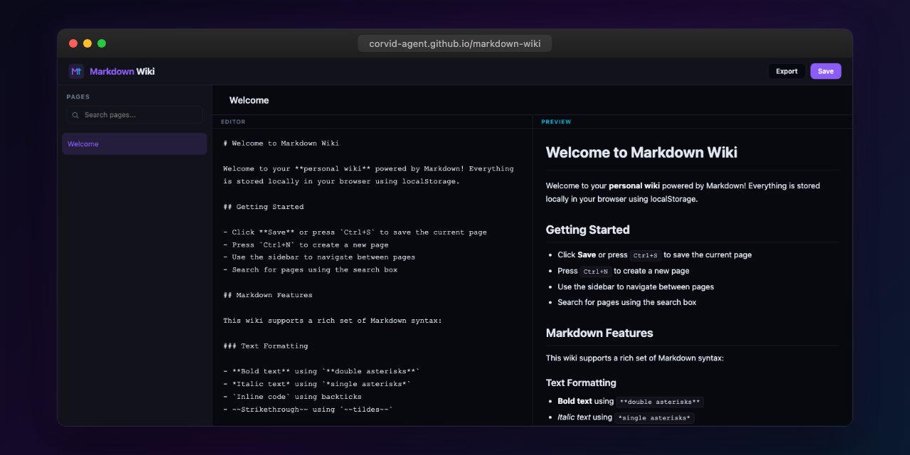

<p align="center"></p>

# Markdown Wiki

A personal wiki and knowledge base with Markdown editing and local storage persistence, built as a single-file HTML application.

## Features

- **Markdown Editor** with live preview side-by-side
- **Full Markdown Rendering** -- headings, bold, italic, links, code blocks, lists, blockquotes, images, horizontal rules, and strikethrough
- **Internal Wiki Links** using `[[Page Name]]` syntax for linking between pages
- **Local Storage Persistence** -- all pages are saved in your browser's localStorage
- **Page Management** -- create, edit, rename, and delete pages
- **Searchable Sidebar** -- quickly filter and find pages
- **Export** -- download any page as a `.md` file
- **Keyboard Shortcuts** -- `Ctrl+S` to save, `Ctrl+N` for a new page
- **Responsive Design** -- sidebar collapses on mobile viewports
- **Dark Theme** -- corvid-agent design system with purple and cyan accents

## Usage

Open `index.html` in any modern browser. No server, build tools, or dependencies required.

### Getting Started

1. The wiki ships with a pre-populated **Welcome** page
2. Press `Ctrl+N` (or `Cmd+N` on macOS) to create a new page
3. Write Markdown in the editor on the left; see the rendered output on the right
4. Press `Ctrl+S` to save your changes to localStorage
5. Use `[[Page Name]]` to create internal links between wiki pages

### Wiki Links

Link between pages with double-bracket syntax:

```markdown
See my [[Notes]] page for more details.
```

If the target page does not exist, the link appears in red. Clicking it will create the page automatically.

### Keyboard Shortcuts

| Shortcut | Action |
|----------|--------|
| `Ctrl+S` | Save current page |
| `Ctrl+N` | Create new page |
| `Tab` | Insert two spaces (in editor) |
| `Escape` | Close modal dialogs |

## Design

Built with the corvid-agent design system:

- **Background**: `#08080f`
- **Cards**: `#12121a`
- **Primary accent**: `#8b5cf6` (purple)
- **Secondary accent**: `#06b6d4` (cyan)
- Monospace font for the editor, system font for UI

## Technical Details

- Zero dependencies -- pure HTML, CSS, and vanilla JavaScript
- Custom Markdown-to-HTML parser (no external libraries)
- All data stored in `localStorage` under `markdown_wiki_pages`
- Single-file architecture for easy deployment

## License

MIT
